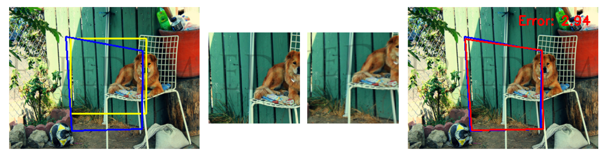
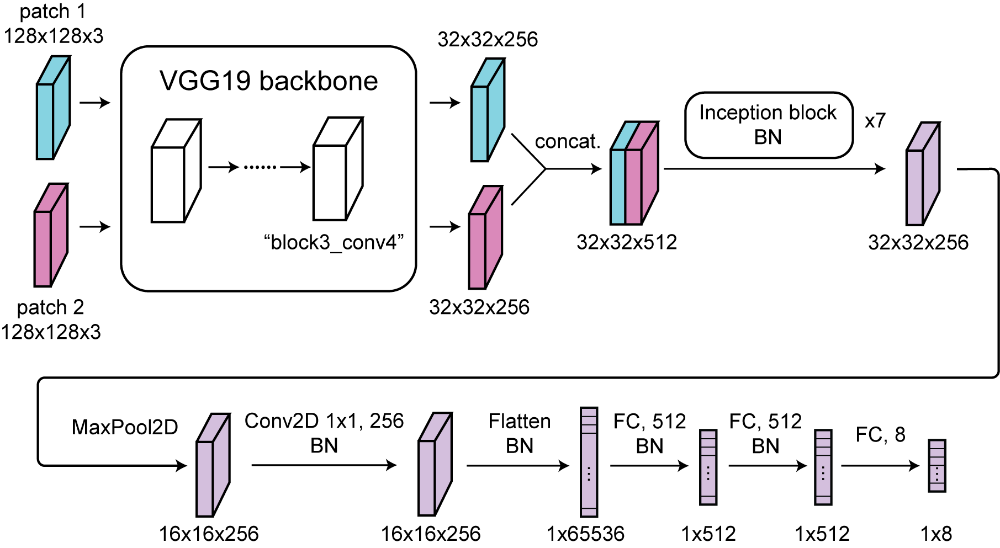
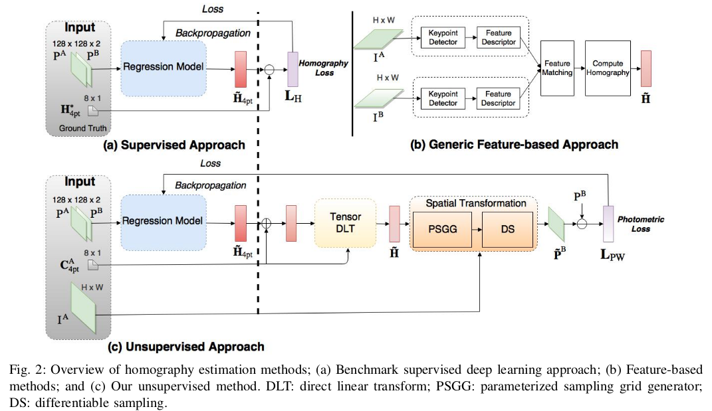
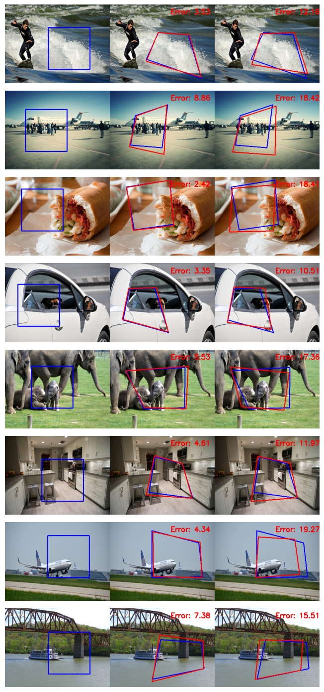

# Homography Net
This project was completed by Yi-Chung Chen, Ji Liu, and Shreyas Acharya. We developed two deep learning approaches for estimating homography: supervised and unsupervised models. We have achieved the average corner error (EPE) of 5.159 pixels for our supervised model, and 10.213 pixels for our unsupervised model. For more details, please look at the `report.pdf` and [project website](https://cmsc733.github.io/2022/proj/p1/) 

## Data
The images used for training, validation and testing are a subset of the COCO dataset. You can find the training data at [here](https://drive.google.com/file/d/1bb1Lhct-aayTflfSFFHWS7FBi1Al9yRD/view?usp=sharing).



The figure above shows the generated dataset. In the left image, the area highlighted in blue is created by randomly shifting four corners of the yellow region. The two patches in the middle are produced by the homography, which maps from the blue region to the yellow region. The network receives these two patches as input, and its output predicts the four corners of the blue zone. The true homography matrix can then be reconstruct using the four corners.


The right image shows an example of output from the network, which predicts the actual corners with high accuracy.

## Architecture
| | 
|:--:| 
| *Architecture* |

The figure above shows our architecture of the model. We use pre-trained VGG-19 to encode 2 patches of images. They are related by a homography produced by randomly perturbing the corner coordinates. Then concatenate the VGG backbone outputs and pass through 7 inception blocks, to extract spatial information. Last, flatten the feature map pass to fully connected layers and produce the 1 by 8 vector which is a predicted x and y coordinate of the corners.

## Training Detials

We followed the supervised [1] and unsupervised [2] approaches which are same training scheme in the image below [2].


- Supervised model: In supervised training, we use L2 difference between predeicted corner coordinates and the ground truth coordinates as the loss function.
- Unsupervised model: In unsupervised training, the predicted warped image is generated by passing the predicted corner coordinates through the differentiable module TensorDLT and the spatial transformer. Backpropagation is derived from the L1 difference, or photometric loss, between the predicted image and the ground truth image.


## Usage
### Train
Use the following code to train the homography network, the default is unsupervised homography net and you can choose the model type by `--ModelType`.
```
python3 ./Train.py --BasePath {directory to your dataset} --ModelType Unsup
```

To train the supervised homography net and set the Number of training epochs by `--NumEpochs`, you can use this code.
```
python3 ./Train.py --ModelType Sup --NumEpochs 10
```

### Test
To test the model, you can use this command. This will load the checkpoint and compute the average EPE (average L2 error between predicted and ground truth homographies) at last. Use `--ModelPath` to set the directory of the checkpoint and `--BasePath` to set the path to your path to the test set.

```
python3 ./Test.py --ModelPath {directory to your checkpoint} --BasePath {directory to your testing dataset} --ModelType Unsup
```

### Visualize
```
python3 ./visualization.py --SupCheckPointPath {directory to supervised model checkpoint} --UnsupCheckPointPath {directory to unsupervised model checkpoint} ----TestPath {directory to your testing dataset}
```

## Visualization & Performance

The example performances from the supervised and unsupervised training are shown below. The original crop regions are shown in the left column. The middle columns shows the output of the ***supervised*** model. The right column shows the output of the ***unsupervised*** model. In general, the supervised model seems to outperform the unsupervised model. 



The quantitative results are summarized below. The error refers to the L2 distance between ground truth corner and predicted corner. 


| Model       | Training L2     | Validation L2    |  Test L2        |
| :---        |    :----:       |     :----:       |    :----:       |
| Supervised  | 5.15 $\pm$ 2.45 | 5.17 $\pm$ 2.44  | 5.23 $\pm$ 2.62 |
| Unsupervised| 10.20 $\pm$ 4.74| 9.99 $\pm$ 4.92  | 10.21 $\pm$ 4.85|

## Reference
1. DeTone, Daniel, Tomasz Malisiewicz, and Andrew Rabinovich. "Deep image homography estimation." arXiv preprint arXiv:1606.03798 (2016).
2. Nguyen, Ty, et al. "Unsupervised deep homography: A fast and robust homography estimation model." IEEE Robotics and Automation Letters 3.3 (2018): 2346-2353.
